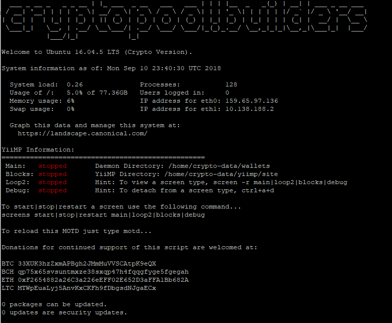
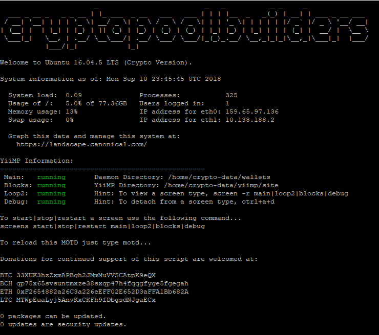

## Update regarding this repo and the future of it. As many of you know I have been gone for many months. Things were going great in my life and then tragedy stuck, and no I am not talking about COVID. Im not going to spin a sad story or give any other details other then, depression is a real thing. Anyone you know or yourself may suffer terribly from it. Don't ignore the signs, don't laugh it off, or take their word that they are ok if its a relative or friend because they are not ok. And don't go at it alone if you suffer silently from it. For those that feel the desire this all doantion addresses have been updated. 

## There are several forks of this repo now that are being maintained by some great people and plenty of help on the discord. Be safe eveyone. - CPB


## Ultimate Crypto-Server Setup Installer! 🚀

## This is opened as a public beta - all features are not final!

All in one installer for your crypto-server needs.

**Ultimate Crypto-Server Setup Installer!** Automates most of the tedious tasks of the following releases:


* YiiMP
* NOMP
* MPOS
* CryptoNote-Nodejs
* Generic faucet script

## TOC

- [Installation](#-installation)
- [Usage](#-usage)
- [YiiMP Single Server Install](#-yiimp-single-server-install)
	- [Commands](#-commands)
- [YiiMP Multi-Server Install](#-yiimp-multi-server-install)
- [NOMP Install](#-nomp-install)
- [MPOS Install](#-mpos-install)
- [CryptoNote-Nodejs Install](#-cryptonote-nodejs-install)
- [Generic faucet script](#-generic-faucet-script)
- [Credits](#-credits)
- [License](#-license)
- [Support](#-support)

## 💾 Installation

Installation:

Requires a fresh Ubuntu 16.04 or Ubuntu 18.04 installation.

```
curl https://raw.githubusercontent.com/cryptopool-builders/Multi-Pool-Installer/master/bootstrap.sh | bash
```

Update:

When a new release is made public updating is as simple as running the same command as above.

```
curl https://raw.githubusercontent.com/cryptopool-builders/Multi-Pool-Installer/master/bootstrap.sh | bash
```

## ▶️ Usage

You may run the installer under root or an existing account. If you already have a user account created on your server that account must already be part of the sudo group.

If you are running as root the installer will prompt you to create a new account.

<p align="center">
  
</p>

After creating the new user account or updating your existing account, you MUST reboot the machine in order for the accounts permissions to be updated properly.

After rebooting the server to your user to start the installer type:
```
multipool
```

## ⚙️ YiiMP Single Server Install

The Yiimp Single Server Install is recommend for private or very small pools. It is recommended to have at least 4GB ram in order to function properly.
Setup is automated after the following questions are answered:

Question | Default | Help
:--|:-:|:--
Are you using a domain name | no | If you plan to use something like example.com, make sure DNS is updated
Are you using a sub-domain as the main domain | no | If you plan to use something like pool.example.com
Domain Name | localhost | Change to your domain either example.com or pool.example.com
Stratum Domain | stratum.domain.name | This should be something other then your domain name
Install SSL | yes | Installs a 90 day cert from LetsEncrypt
Support Email | root@localhost | Used to send you system alerts
Your Public IP | pulls ip last used to acess web server | To verify go to http://www.whatsmyip.org
DB Root Password | autogenerated 36 character password | Default mysql root password
DB Panel User Password | autogenerated 36 character password | Default mysql frontend password
DB Stratum Password | autogenerated 36 character password | Default mysql stratum password
Admin Portal Access Location | AdminPortal | to access example.com/site/AdminPortal

Installation will take about 25 minutes to fully complete. You will get a message on the screen letting you know it has finished.

#### A server reboot is REQUIRED after the installer is completed to finalize the installation process!

After rebooting the server log back in to your user account. And you will be greeted by the following screen:

<p align="center">
  
</p>

#### On first reboot it may take up to 10 minutes before the cron screens auto-start. After waiting ten minutes type:
```
motd
```
and you should see this:

<p align="center">
  
</p>

#### To help make your server more secure we have changed the install locations and directory structure of YiiMP as follows:

Directory | Files
:--|:-:
/home/crypto-data/yiimp | General install location for YiiMP
/home/crypto-data/yiimp/starts | screens and stratum sh files - you do not need to run these
/home/crypto-data/yiimp/site | -
/home/crypto-data/yiimp/site/web | New location for YiiMP web files
/home/crypto-data/yiimp/site/backup | backup location for mysql DB
/home/crypto-data/yiimp/site/configuration | New location of your serverconfig.php
/home/crypto-data/yiimp/site/crons | New location of the `main:blocks:loop2` sh files
/home/crypto-data/yiimp/site/log | New location for debug.log and your nginx server log
/home/crypto-data/yiimp/site/stratum | New location for your stratum files
/home/crypto-data/wallets | New location for wallets

Permissions have been setup correctly allowing your main user write acess to the /home/crypto-data directories! Changing file or directory permissions after install will cause your YiiMP to not function correctly, you have been warned!!

By default even though all stratum algos start on server start, the ports have been blocked by the firewall. To open a port type:
```
sudo ufw allow port number
```

From there your YiiMP Single Server installation is fully completed. You can now go to example.com/site/AdminPortal to access your admin section and start adding your coins.

#### 🔗 Commands

To view a screen type:
```
screen -r main|loop2|blocks|debug
```
To detach from a screen type:
```
ctrl+a+d
```
To start, stop or restart main|loop2|blocks|debug type:
```
screens start|stop|restart main|loop2|blocks|debug
```
We also suggest that you type:
```
yiimp
```
and get to know those commands as well!

## 🤖 YiiMP Multi-Server Install

The YiiMP Multi-Server Install is recommended for those that want to run larger public pools. This offers the most security and is a lot more complex on the setup.

The following two tables show you the perfered server setup for the multi-server setup:

Role | OS Version | Recommended Ram
:--|:--|:-:
Web Server | Ubuntu 16.04 or Ubuntu 18.04 | 2GB
DB & Stratum Server | Ubuntu 16.04 or Ubuntu 18.04 | 4GB
Daemon Server | Ubuntu 16.04 or Ubuntu 18.04 | 8GB+

 or

Role | OS Version | Recommended Ram
:--|:--|:-:
Web Server | Ubuntu 16.04 or Ubuntu 18.04 | 2GB
DB Server | Ubuntu 16.04 or Ubuntu 18.04 | 2GB
Stratum Server | Ubuntu 16.04 or Ubuntu 18.04 | 2GB
Daemon Server | Ubuntu 16.04 or Ubuntu 18.04 | 8GB+

It is also highly recommended to use a provider that offers private IP's between your servers. If your provider only offers public IP's you must install Wireguard (Installer provided). This will setup a secure VPN connection between your servers for the backend communication.

#### If installing wireguard do not modify the default private IP's that are provide. Installation will fail!

Just like with the single server install there must be a user account created. If you attempt to run the script under root, it will force you to create a new user account and log in to it.

After the user accounts are created on each server, setup <b>MUST</b> begin on the server that is hosting your database. You do not need to run the installer individually on each server.  

#### ✏️ During the setup process you will be prompted to enter the user name and password for each of your servers. This is required for the installer to be able to SSH in to each server to perform the installation tasks on that server.

Installation will take about 25 minutes to fully complete. You will get a message on the screen letting you know it has finished.

#### A server reboot is REQUIRED after the installer is completed to finalize the installation process!

#### On first reboot it may take up to 1 minute before the cron screens auto-start. After waiting one minute type:
```
motd
```

#### To help make your server more secure we have changed the install locations and directory structure of YiiMP as follows:

Directory | Files | Server
:--|:-:|:--
/home/crypto-data/yiimp | General install location for YiiMP | All
/home/crypto-data/yiimp/starts | screens and stratum sh files - you do not need to run these | Web and Stratum
/home/crypto-data/yiimp/site | - | Web and Stratum
/home/crypto-data/yiimp/site/web | New location for YiiMP web files | Web
/home/crypto-data/yiimp/site/backup | backup location for mysql DB | Web
/home/crypto-data/yiimp/site/configuration | New location of your serverconfig.php | Web
/home/crypto-data/yiimp/site/crons | New location of the `main:blocks:loop2` sh files | Web
/home/crypto-data/yiimp/site/log | New location for debug.log and your nginx server log | Web
/home/crypto-data/yiimp/site/stratum | New location for your stratum files | Stratum
/home/crypto-data/wallets | New location for wallets | Daemon


Permissions have been setup correctly allowing your main user write acess to the /home/crypto-data directories! Changing file or directory permissions after install will cause your YiiMP to not function correctly, you have been warned!!

By default even though all stratum algos start on server start, the ports have been blocked by the firewall. To open a port type:
```
sudo ufw allow port number
```
You <b>MUST</b> also open the RPC Port number on the daemon server when adding new coins. Failing to open the port will result in a connection time out error.

From there your YiiMP Multi Server installation is fully completed. You can now go to example.com/site/AdminPortal to access your admin section and start adding your coins.

#### 🔗 Commands

To view a screen type:
```
screen -r main|loop2|blocks|debug
```
To detach from a screen type:
```
ctrl+a+d
```
To start, stop or restart main|loop2|blocks|debug type:
```
screens start|stop|restart main|loop2|blocks|debug
```
We also suggest that you type:
```
yiimp
```
and get to know those commands as well!


## 📦 NOMP Install

The NOMP options install everything you need to run NOMP and gets your first coin installed. It is recommended to have at least 2GB ram in order to function properly.

During the initial setup you will be asked similar questions as the YiiMP installer in addition you will also be asked for the first coin that you wish to have installed. After all the questions are answered setup will be fully automated until the coin installation where you will need to copy and paste the coind and coin-cli names.

#### To help make your server more secure we have changed the install locations and directory structure of NOMP as follows:

Directory | Files
:--|:-:
/home/crypto-data/nomp | General install location for NOMP
/home/crypto-data/nomp/starts | required start files
/home/crypto-data/nomp/core | New location for NOMP nodejs files
/home/crypto-data/nomp/configuration | New location for NOMP config files
/home/crypto-data/nomp/logs | New location for NOMP/Nginx log files
/home/crypto-data/nomp/site/web | New Location of NOMP html files
/home/crypto-data/wallets | New location for wallets

Permissions have been setup correctly allowing your main user write acess to the /home/crypto-data directories! Changing file or directory permissions after install will cause your NOMP to not function correctly, you have been warned!!

By default all non web ports have been blocked by the firewall, with exception of the first default coin. To open any other ports type:
```
sudo ufw allow port number
```

## 🐣 MPOS Install

This feature will be added at a later date.

The MPOS options install everything you need to run MPOS and gets your first coin installed. It is recommended to have at least 4GB ram in order to function properly.

During the initial setup you will be asked similar questions as the YiiMP installer in addition you will also be asked for the first coin that you wish to have installed. After all the questions are answered setup will be fully automated.  

## 🐛 CryptoNote-Nodejs Install

This feature will be added at a later date.

The CryptoNote-Nodejs options install everything you need to run CryptoNote-Nodejs and gets your first coin installed. It is recommended to have at least 4GB ram in order to function properly.

During the initial setup you will be asked similar questions as the YiiMP installer in addition you will also be asked for the first coin that you wish to have installed. After all the questions are answered setup will be fully automated.

## 📚 Generic faucet script

This feature will be added at a later date.

The faucet options install everything you need to run your own faucet script and setup multiple coins on it. Each coin will have their own sub-site.
Setup is automated after the following questions are answered:

## ❤️ Credits

The following GitHubs have been a source of inspiration and code:

* [mailinabox](https://github.com/mail-in-a-box/mailinabox)
* [realeas-it](https://github.com/webpro/release-it)

The following forks have been used in the making of the script:

* [YiiMP](https://github.com/tpruvot/yiimp)
* [NiceNOMP](https://github.com/cryptosharks131/NiceNOMP)
* [UNOMP](https://github.com/UNOMP/unified-node-open-mining-portal)
* [cryptonote-nodejs](https://github.com/dvandal/cryptonote-nodejs-pool)
* [faucet script](https://github.com/ChristianGrieger/Cryptocurrency-faucet-script)

## 🎓 License

[MIT](http://webpro.mit-license.org/)

## 🎁 Support

Join our active discord channel:

https://discord.gg/UGbGvna

Find our BitCoinTalk Thread at:

https://bitcointalk.org/index.php?topic=4980079.0

Donations for continued support of this script are welcomed at:

* BTC 3LegHBKdAmcdN9usBae5UPVnQWk5vCrUDy
* BCH 1C5b876B7ZJo6P1hjqKGBmorYoY8RuAm7D
* ETH 0x7BAEaae15De37A93e5Bcf27622F2E65ede90A35C
* ETC 0xc5C3E017087adB10C2FE085cF8eA9b1c9867Ff28
* LTC MAutGukgacY74Pv38k4DGs91RGTDbmUSmQ
